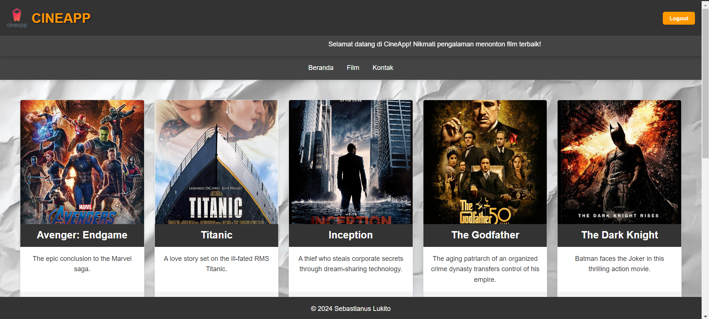
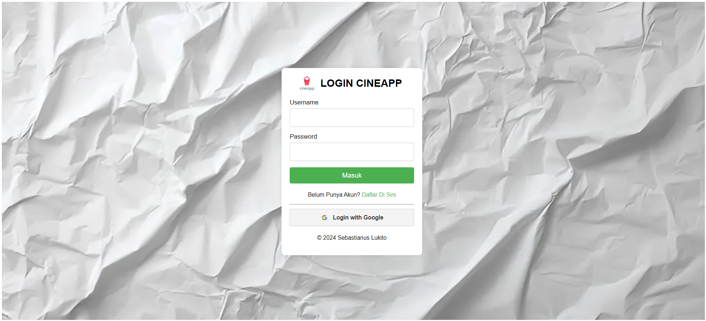
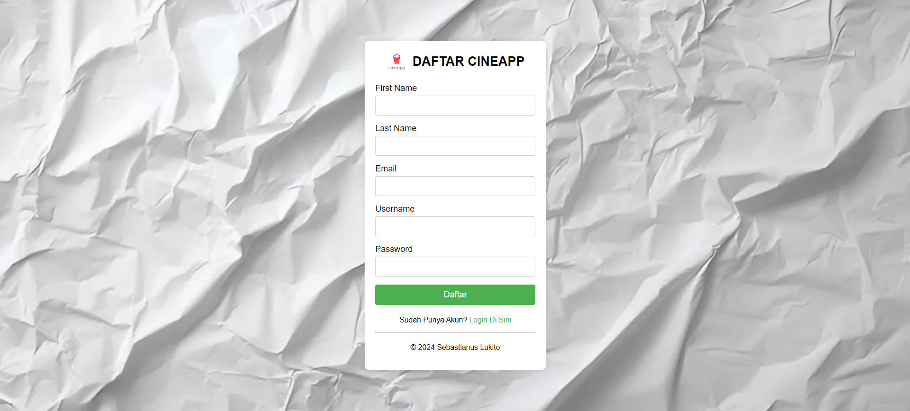
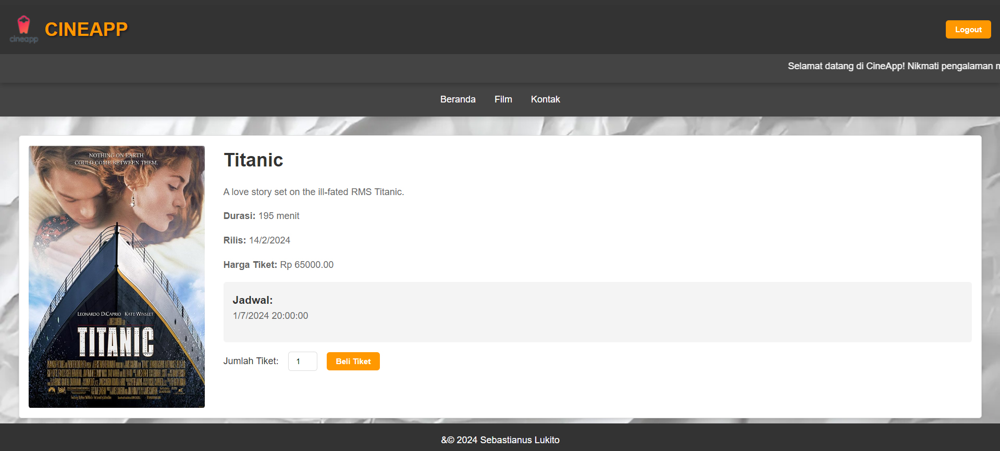
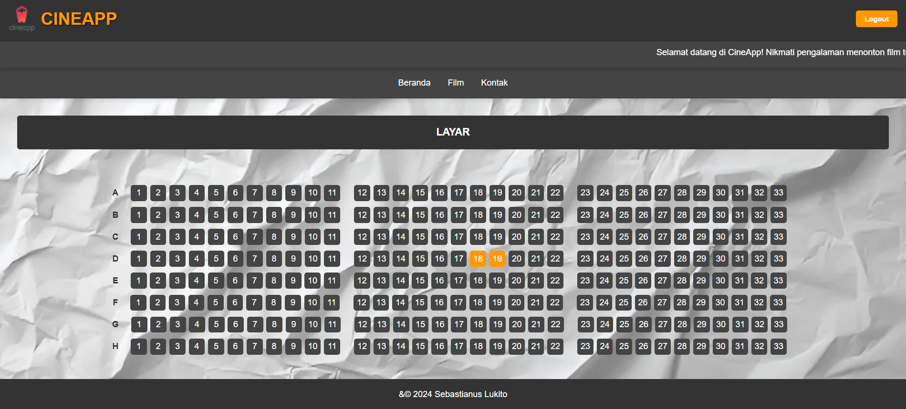
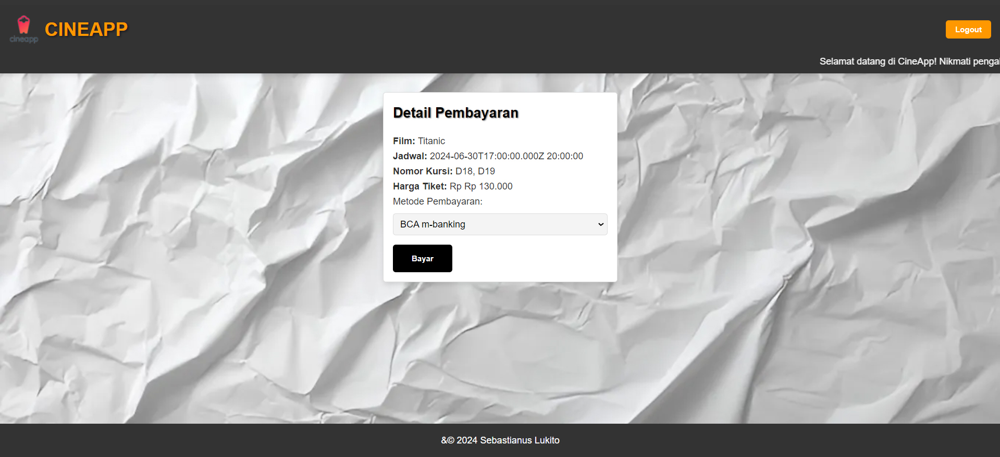
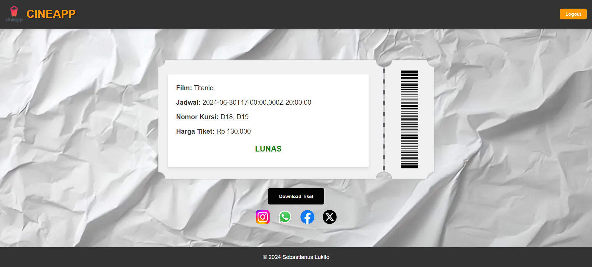

# Web Tiket Bioskop



This project is a web application for booking movie tickets and for final test of web programming built by:
Sebastianus Lukito (41522110051)

## Prerequisites

Before you begin, ensure you have met the following requirements:
- You have installed Node.js and npm.
- You have a running instance of MySQL (or any other specified database).

## Installation

1. Clone the repository:
    ```bash
    git clone <repository-url>
    cd webTiketBioskop
    ```

2. Install the dependencies:
    ```bash
    npm install
    ```

3. Set up the environment variables:
    - Create a `.env` file in the root directory and add the required environment variables as specified in `.env.example` or the following:
    ```env
    DB_HOST=<your-database-host>
    DB_USER=<your-database-username>
    DB_PASSWORD=<your-database-password>
    DB_NAME=<your-database-name>
    PORT=<your-server-port>
    ```

## Running the Server

1. Start the server:
    ```bash
    npm start
    ```

    This will run the server as specified in the `Procfile`.

## Database Setup

1. Ensure your MySQL (or specified database) is running.
2. Create the necessary database:
    ```sql
    CREATE DATABASE movie_booking;
    USE movie_booking;
    ```

3. Create the required tables:
    ```sql
    -- Create table for bookings
    CREATE TABLE book (
        id INT(11) NOT NULL AUTO_INCREMENT,
        user_id INT(11) DEFAULT NULL,
        jadwal_id INT(11) DEFAULT NULL,
        jumlah_tiket INT(11) DEFAULT NULL,
        tanggal_booking TIMESTAMP DEFAULT CURRENT_TIMESTAMP,
        PRIMARY KEY (id),
        KEY user_id (user_id),
        KEY jadwal_id (jadwal_id)
    );

    -- Create table for films
    CREATE TABLE film (
        id INT(11) NOT NULL AUTO_INCREMENT,
        judul VARCHAR(255) NOT NULL,
        deskripsi TEXT DEFAULT NULL,
        durasi INT(11) DEFAULT NULL,
        rilis DATE DEFAULT NULL,
        harga_tiket DECIMAL(10,2) NOT NULL,
        poster_filename VARCHAR(255) DEFAULT NULL,
        PRIMARY KEY (id)
    );

    -- Create table for schedules
    CREATE TABLE jadwal (
        id INT(11) NOT NULL AUTO_INCREMENT,
        film_id INT(11) DEFAULT NULL,
        ruangan_id INT(11) DEFAULT NULL,
        tanggal DATE DEFAULT NULL,
        waktu TIME DEFAULT NULL,
        PRIMARY KEY (id),
        KEY film_id (film_id),
        KEY ruangan_id (ruangan_id)
    );

    -- Create table for rooms
    CREATE TABLE ruangan (
        id INT(11) NOT NULL AUTO_INCREMENT,
        nama VARCHAR(255) NOT NULL,
        PRIMARY KEY (id)
    );

    -- Create table for users
    CREATE TABLE user (
        id INT(11) NOT NULL AUTO_INCREMENT,
        username VARCHAR(255) NOT NULL,
        password VARCHAR(255) NOT NULL,
        type ENUM('admin','user') NOT NULL,
        first_name VARCHAR(255) NOT NULL,
        last_name VARCHAR(255) NOT NULL,
        email VARCHAR(255) NOT NULL,
        facebook_id VARCHAR(255) DEFAULT NULL,
        google_id VARCHAR(255) DEFAULT NULL,
        PRIMARY KEY (id)
    );
    ```

4. Update the `.env` file with your database credentials.

## Usage

Open your browser and go to `http://localhost:<your-server-port>` to access the application.

## Screenshots

### Main Menu


### Login Page


### Registration Page


### Ticket Purchase


### Seat Selection


### Payment


### Ticket


## Directory Structure

- `server.js`: Entry point for the server.
- `.env`: Environment variables.
- `package.json`: Project metadata and dependencies.
- `public/`: Contains HTML files for the front-end.

## Dependencies

Refer to `package.json` for a full list of dependencies.

## License

This project is licensed under the MIT License.
